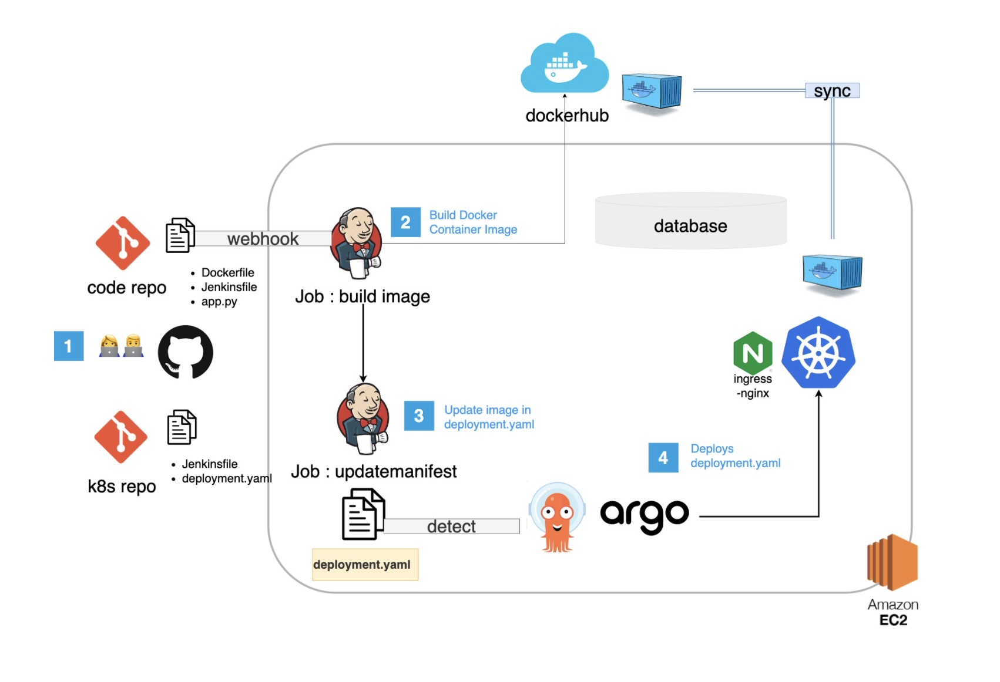

# devOps

## CICD 환경 구성

> Search 통해 재구성 by llunaB

### 환경구성(실행과정)

1. 개발자가 코드를 코드 레포지토리에 업로드합니다.

2. 코드 레포지토리와 Webhook으로 연결된 Jenkins Jon(Build Image) 가 실행됩니다.

   - 레포지토리 내의 Dockerfile 을 기반으로 Docker Container Image 를 빌드합니다.

   - Dockerhub에 이미지를 push합니다.

3. Jenkins Job(build image) 가 실행된 후 Jenkins Job(updatemanifest) 를 trigger합니다.deployment.yaml 을 업데이트하여 최신 컨테이너로 설정합니다.

4. githubs tool 인 argoCD  가 kubernetes manifest 레포지토리를 monitor 하고 있다가, 쿠버네티스 클러스터의 상태와 다를 경우, deployment.yaml 파일을 쿠버네티스 클러스터로 deploy 합니다.

5. 코드가 업데이트 되면 새로운 태그의 Docker Container Image 가 도커허브에 업로드되고, 3, 4를 반복합니다.

### 도구 설명

- `Argo CD`: 깃 레포지토리의 상태를 확인하고 Kubernetes 를 Control 하기 위해 사용합니다.
- `Jenkins`: pipeline 을 통해 코드를 빌드하고, 테스트하고 배포하는 단계를 자동적으로 실행하기 위해 사용합니다. 하루에도 여러 번 코드를 빌드하고 테스트 할 수 있습니다. Jenkins가 없다면 코드가 변경될 때 마다 매번 수동으로 직접 위의 단계를 진행해야 합니다. 
- `git` : git은 개발 소스 코드의 변경 사항을 추적하는 도구로, 버젼관리를 통해 코드를 복원하거나 개발자 간 작업을 조정할 수 있습니다.
- `github` : github은 웹 기반으로 git repository를 호스팅하는 서비스로 작업물을 관리하고 온라인 web 상에서 공유할 수 있습니다.
- `docker` : Docker는 컨테이너를 통해 OS 관계없이 서버를 실행할 수 있습니다. 또한 언어나 프레임워크 버젼 등 개발 환경을 정해 컨테이너와하면 오류를 최소화할 수 있습니다. 새로운 서버에 동일한 환경을 구축하는 것도 가능하고, 여러 개의 도커 컨테이너를 통해 서버를 증설할 수 있습니다.
- `dockerhub` : 컨테이너 이미지를 온라인 상에서 공유하고 다운로드 받아 사용할 수 있습니다.
- `kubernetes` : 도커 컨테이너를 관리하는데, 컨테이너 트래픽을 관리하거나 자동배치, 자동재시작 등을 수행합니다.
- `ingress-nginx` : 클러스터 내의 서비스에 대한 외부 접근을 관리합니다. 부하분산, SSL 관련 업무를 수행합니다. 기존의 nginx 가 하는 역할(포트포워딩, 프록시 등) 이 필요하니까 사용합니다.
- `AWS EC2` : 가상 서버를 제공합니다. 트래픽 사용량 만큼만 요금을 지불하면 되고, 네트워킹 보안 등 관리가 편리하기 때문에 클라우드 서버를 사용합니다.